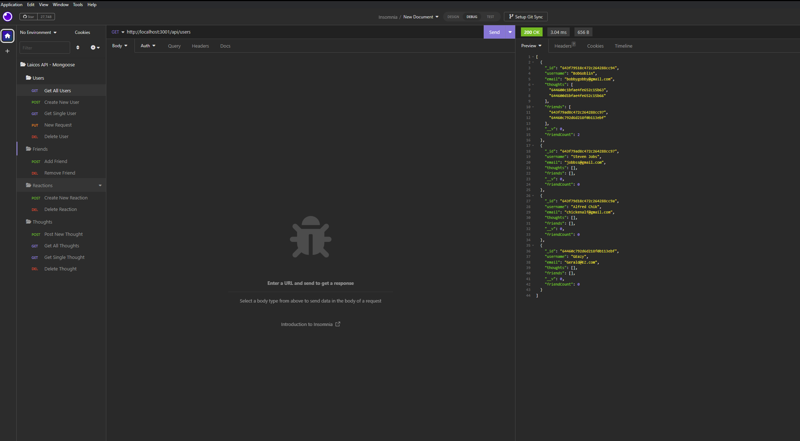

# 18 NoSQL: Laicos Network API

## Summary

Laicos Network API is a cool social network application that lets us do a ton of things such as, create a new 
user, add other users to your friends list, post your thoughts, and have your friends react to your created 
thoughts! 

***
## User Story

```md
AS A social media startup
I WANT an API for my social network that uses a NoSQL database
SO THAT my website can handle large amounts of unstructured data
```

## Acceptance Criteria

```md
GIVEN a social network API
WHEN I enter the command to invoke the application
THEN my server is started and the Mongoose models are synced to the MongoDB database
WHEN I open API GET routes in Insomnia for users and thoughts
THEN the data for each of these routes is displayed in a formatted JSON
WHEN I test API POST, PUT, and DELETE routes in Insomnia
THEN I am able to successfully create, update, and delete users and thoughts in my database
WHEN I test API POST and DELETE routes in Insomnia
THEN I am able to successfully create and delete reactions to thoughts and add and remove friends to a user’s friend list
```


## Video Walkthrough

This application has not been deployed so I've made a short [video](https://drive.google.com/file/d/1s8hODCXVKvW5ut5Ws46vUVvRo6yN5cDq/view) to walk through the POST, GET, PUT, and DELETE routes in Insomnia.



### This application was built using Javascript, MongoDB, and npm.

***

## License

Please refer to the license in the repository.

## Thank you!
